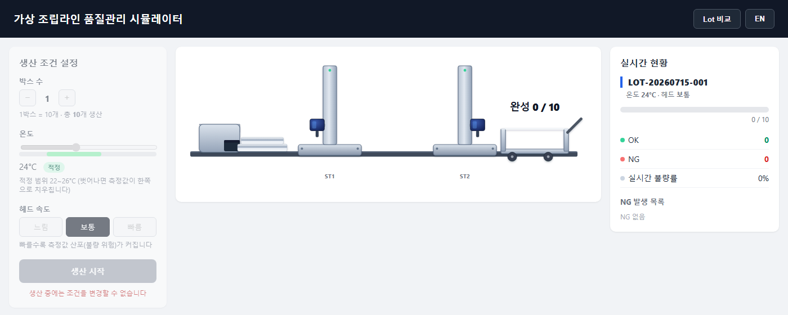

# Virtual Assembly Line Quality Simulator

A miniature MES (Manufacturing Execution System) simulator that runs a 2-station serial assembly line in the browser. Set production conditions (temperature, head speed) and start a run — two automatic screw-fastening machines process units with perfectly synchronized up/down motion. Every fastening event generates a real measurement written to an Excel (.xlsx) file, out-of-spec values are tracked as NG, and an AI-interpreted quality report is generated automatically when a lot completes.

> Note: this was originally built for a Korean-language manufacturing context, so Korean is the default UI language. A language toggle (top-right, "EN" / "한국어") switches the whole app — and both report types — to English. The screenshot below shows the Korean default.



## Features

- **Production condition panel**: box count (1–5, 10 units/box), temperature (20–30°C, ideal range 22–26°C), head speed (slow/normal/fast) — these conditions actually shift the measurement distribution (bias/spread) and the tact timing, not just cosmetically.
- **SVG assembly-line animation**: a single state machine owns the entire line, so both fastening heads always move with exactly the same timing (including "dry" cycles over empty slots). New units slide out of the feeder gate; finished units slide into the cart and disappear.
- **Real Excel logging**: one row per unit (SN) recording both stations' torque/judgment/timestamp; out-of-spec cells are highlighted red. Includes a dedicated NG-tracking sheet and a lot-summary sheet.
- **AI-interpreted reports**: on lot completion, Python aggregates the numbers and an in-house LLM generates a separate analysis and improvement recommendation. Report generation always succeeds even if the LLM is unavailable (a graceful "AI comment generation failed" fallback is shown instead).
- **Lot comparison**: pick two completed lots to get a side-by-side condition/defect-rate table, a rule-based (non-LLM) conclusion sentence, and an LLM interpretation of what might explain the difference.
- **Korean / English toggle**: a top-right button switches the main app and both report types between languages, with the choice remembered across visits. The one exception is AI-generated analysis/recommendation text, which is only ever produced in Korean (no translation API involved) — English mode shows a small note saying so.

## Tech Stack

- **Backend**: Python 3.12, FastAPI, uvicorn
- **Excel**: openpyxl
- **Frontend**: plain HTML/CSS/JS (no framework), SVG animation
- **LLM integration**: OpenAI-compatible API (`openai` package) — e.g. an in-house gpt-oss server

## Getting Started

```bash
# 1. Create and activate a virtual environment
python -m venv venv
source venv/Scripts/activate   # macOS/Linux: source venv/bin/activate

# 2. Install dependencies
pip install -r requirements.txt

# 3. Configure the LLM integration (optional — the app works without it,
#    reports just show "AI comment generation failed" instead)
cp .env.example .env
# edit .env: LLM_BASE_URL / LLM_MODEL / LLM_API_KEY
# (if the backend is Ollama, point at its OpenAI-compatible path /v1,
#  not its native /api/chat path)

# 4. Run the server
uvicorn main:app --reload
# → http://127.0.0.1:8000
```

You can also exercise the core logic (measure → excel → aggregate → report) without the web layer:

```bash
python pipeline_test.py 2 --temp 29 --head 빠름
```

### Output locations

- Excel files (`.xlsx`): `config.EXCEL_DIR`
- Lot / comparison reports (HTML): `config.REPORT_DIR`
- Completed-lot history (`lots_index.json`, internal data used by the compare feature): `./output`

These paths currently default to an absolute local path on the machine this repo was first built on. If you move the project to another computer, update `EXCEL_DIR`/`REPORT_DIR` in `config.py` to match that environment.

## Project Structure

| File | Role |
|---|---|
| `config.py` | All tunable settings (specs, condition multipliers, file paths, LLM env vars) |
| `measurement.py` | Condition-aware measurement generation formula |
| `lot_manager.py` | Lot state management, aggregation (`aggregate()`) |
| `excel_writer.py` | Real Excel writing (one row per unit, retries on save failure) |
| `report.py` | Lot report generation, `lots_index.json` management |
| `compare.py` | Lot comparison report generation |
| `llm_client.py` | LLM calls (analysis/recommendation JSON split, graceful fallback) |
| `main.py` | FastAPI app (7 API routes + static file serving) |
| `pipeline_test.py` | CLI that runs the core logic without the web server |
| `static/` | Frontend (condition panel, SVG line animation, status panel, lot-compare UI) |
| `static/i18n.js` | Shared Korean/English toggle engine, also loaded by the server-rendered reports |

## API

| Method | Path | Description |
|---|---|---|
| POST | `/api/lot` | Create a lot |
| POST | `/api/measure` | Run a measurement |
| POST | `/api/unit-complete` | Notify unit completion (auto-generates the report on the last unit) |
| GET | `/api/status/{lot_id}` | Live status (polled every 0.5s) |
| GET | `/api/report/{lot_id}` | Lot report HTML |
| GET | `/api/lots` | List of completed lots |
| GET | `/api/compare?lot_a=&lot_b=` | Lot comparison report |

## Docs

- [`SPEC_CHANGES.md`](SPEC_CHANGES.md) — changelog relative to the original spec PDF
- `가상조립라인_프로젝트명세서.md.pdf` — the original project spec (Korean)
- [`CLAUDE.md`](CLAUDE.md) — codebase architecture notes (for AI coding assistants)
